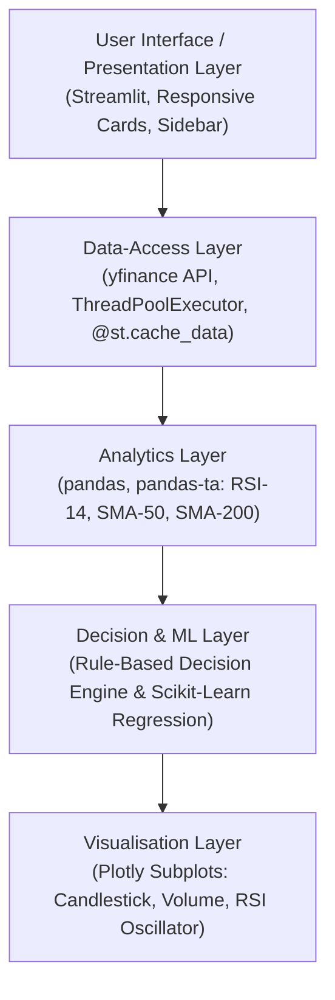

# AI Stock Insights Portal 📈
### A Web-Based Technical-Analysis Dashboard for Indian Equity Markets
**B.Tech. II Year III Semester Mini Project (Course Code: BCC 351)**  
*Dronacharya Group of Institutions, Greater Noida | Affiliated to Dr. A.P.J. Abdul Kalam Technical University (AKTU), Lucknow*  
*Academic Session: 2025–2026*

---

## 👥 Project Team Members
| Name | University Roll Number | Role |
| :--- | :--- | :--- |
| **Rohit** | `2502301530051` | Data Pipeline & Technical Indicator Engine |
| **Shubh** | `2502301530059` | Machine Learning Models & Visualizations |
| **Utkarsh** | `2502301530069` | Web Dashboard Architecture & Integration |

---

## 🚀 Overview & Objectives
The **AI Stock Insights Portal** is an interactive, web-based technical analysis application built with Python and Streamlit. It fetches real-time market data for National Stock Exchange (NSE) equities, calculates key technical indicators, and produces an explainable, rule-based **BUY**, **SELL**, or **HOLD** signal with confidence scores.

### Key Objectives
1. **Live Market Data Retrieval:** Retrieve 1 year of daily historical OHLCV market data using `yfinance`.
2. **Technical Indicator Engine:** Calculate 14-period RSI, 50-day SMA, 200-day SMA, and Bollinger Bands using `pandas-ta`.
3. **Transparent Decision Layer:** Implement the exact rule-based classification specified in the project synopsis.
4. **Machine Learning Price Forecasting:** 7, 15, and 30-day price trend projection using Scikit-Learn Linear Regression.
5. **Interactive Data Visualizations:** Multi-panel Candlestick, Volume, and RSI charts via Plotly.
6. **Market Overview:** Fast parallel multi-threaded scanning of 30+ NSE equities with signal filtering.
7. **Two-Stock Comparison Engine:** Head-to-head metrics and 1-year normalized cumulative return comparison.
8. **Virtual Paper Trading Simulator:** Risk-free portfolio execution with ₹1,00,000 virtual capital and live P&L tracking.
9. **Portfolio Risk Optimizer:** Annualized volatility, estimated Sharpe ratio, and asset correlation matrix heatmap.
10. **Price Alert Notifications:** Real-time upper and lower price threshold triggers.
11. **AI Stock Tutor & Chatbot:** Educational modules and interactive financial learning assistant.

---

## 🧠 Decision & Signal Engine (Synopsis Rules)

| Condition | Result | Interpretation & Confidence |
| :--- | :--- | :--- |
| **$\text{RSI} < 40 \text{ and } \text{Close} > 0.95 \times \text{SMA}_{50}$** | 🟢 **BUY** | **88% Confidence** — Oversold condition near moving-average support. Strategic accumulation favored. |
| **$\text{RSI} > 65 \text{ or } \text{Close} < 0.92 \times \text{SMA}_{50}$** | 🔴 **SELL** | **82% Confidence** — Overbought condition or notable break below 50-day SMA support. Risk mitigation recommended. |
| **All other conditions** | 🟡 **HOLD** | **65% Confidence** — Price consolidating in range. No strong breakout or breakdown trigger. |

---

## 🏗️ 5-Layer Software Architecture


---

## 💻 Installation & Setup

### Prerequisites
- Python 3.10+ installed on your system.

### 1. Clone / Open Project Folder
```bash
cd "c:\Users\prate\OneDrive\Desktop\Shubh_Personal\Mini Project"
```

### 2. Install Dependencies
```bash
pip install -r requirements.txt
```

### 3. Run Application
```bash
streamlit run app.py
```
The application will open in your default browser at `http://localhost:8501`.

---

## 🔐 Sign-In Credentials
- **⚡ 1-Click Guest Access:** Click the prominent **"1-Click Guest / Evaluator Access (Demo Mode)"** button on the sign-in screen to instantly evaluate the application without credentials.
- **Pre-configured Accounts:**
  - `admin` / `admin123`
  - `shubh` / `shubh123`
  - `rohit` / `rohit123`
  - `utkarsh` / `utkarsh123`
- **New Account Registration:** You can also register a custom user profile under the "Create Account" tab.

---

## 📂 Project Directory Structure
```
Mini Project/
├── app.py                          # Main Streamlit application codebase
├── requirements.txt                # Python package dependencies
├── README.md                       # Comprehensive project documentation
└── AI stocks prediction app (2).pdf # Official BCC 351 Mini Project Synopsis
```

---

## ⚖️ Academic Disclaimer
*This software dashboard is developed strictly for educational and academic evaluation purposes under the B.Tech BCC 351 curriculum. It does not provide certified financial advice or guaranteed market predictions.*
